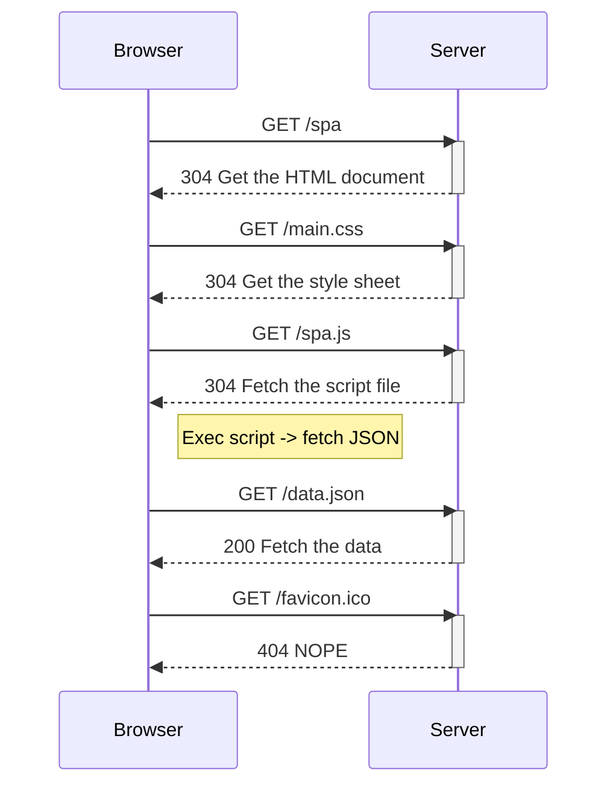

# Moving to Single Page App

```mermaid
sequenceDiagram
    participant Browser
    participant Server

    Browser ->> Server: GET /spa
    activate Server
    Server -->> Browser: 304 Get the HTML document
    deactivate Server

    Browser ->> Server: GET /main.css
    activate Server
    Server -->> Browser: 304 Get the style sheet
    deactivate Server

    Browser ->> Server: GET /spa.js
    activate Server
    Server -->> Browser: 304 Fetch the script file
    deactivate Server

    Note right of Browser: Exec script -> fetch JSON

    Browser ->> Server: GET /data.json
    activate Server
    Server -->> Browser: 200 Fetch the data
    deactivate Server

    Browser ->> Server: GET /favicon.ico
    activate Server
    Server -->> Browser: 404 NOPE
    deactivate Server
```
