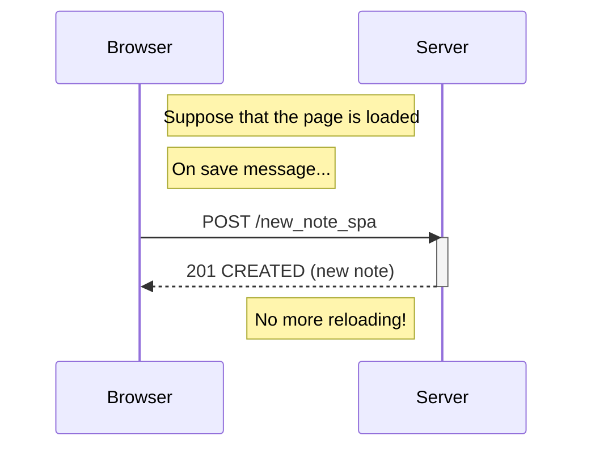

# Single page app new note diagram

```mermaid
sequenceDiagram
    participant Browser
    participant Server

    Note left of Server: Suppose that the page is loaded

    Note right of Browser: On save message...

    Browser ->> Server: POST /new_note_spa
    activate Server
    Server -->> Browser: 201 CREATED (new note)
    deactivate Server

    Note left of Server: No more reloading!
```
