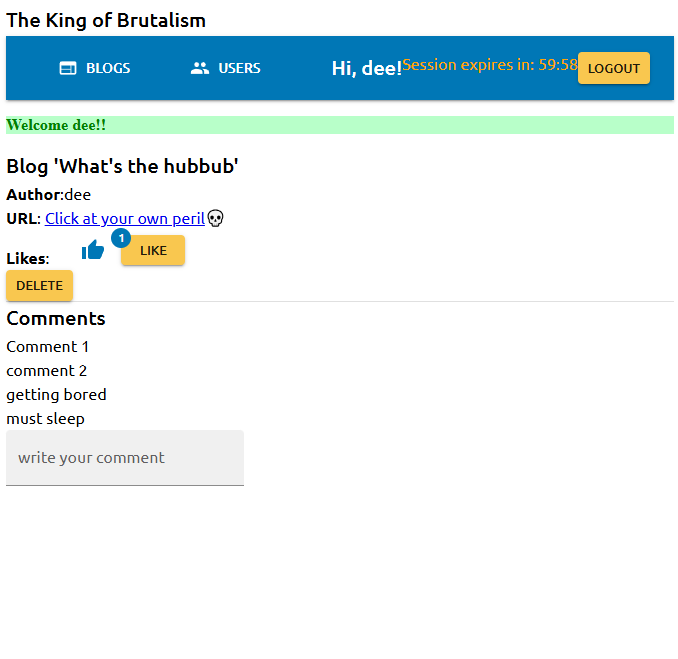

<strong>Monorepo is messy...</strong>

Not so brutal anymore now, is it?

<h2><a href="https://github.com/boolYikes/fsopen/tree/main/Part00">Part 0</a></h2>

    
Expand to see

    <ul>
        <li>Ex01</li>
        <li>Ex02</li>
        <li>Ex03</li>
        <li><a href="https://github.com/boolYikes/fsopen/blob/main/Part00/ex04.md">Ex04</a></li>
        <li><a href="https://github.com/boolYikes/fsopen/blob/main/Part00/ex05.md">Ex05</a></li>
        <li><a href="https://github.com/boolYikes/fsopen/blob/main/Part00/ex06.md">Ex06</a></li>
    </ul>

<h2><a href="https://github.com/boolYikes/fsopen/tree/main/Part01">Part 1</a></h2>

    
Expand to see

    <ul>
        <li><a href="https://github.com/boolYikes/fsopen/tree/main/Part01/courseinfo/README.md">Ex1.1-1.5 course info</a></li>
        <li><a href="https://github.com/boolYikes/fsopen/tree/main/Part01/unicafe/README.md">Ex1.6-1.11 unicafe</a></li>
        <li><a href="https://github.com/boolYikes/fsopen/tree/main/Part01/anecdotes/README.md">Ex1.12-1.14 anecdote</a></li>
    </ul>

<h2><a href="https://github.com/boolYikes/fsopen/tree/main/Part02">Part 2</a></h2>

    
Expand to see

    <ul>
        <li><a href="https://github.com/boolYikes/fsopen/tree/main/Part02/courseinfo_continued">Ex2.1-2.5 course info continued</a></li>
        <li><a href="https://github.com/boolYikes/fsopen/tree/main/Part02/phonebook">Ex2.6-2.17 phonebook</a></li>
        <li><a href="https://github.com/boolYikes/fsopen/tree/main/Part02/data_for_countries">Ex2.18-2.20 data for countries</a></li>
    </ul>

<h2><a href="https://github.com/boolYikes/fsopen/tree/main/Part03">Part 3</a></h2>

    
Expand to see

    <ul>
        <li><a href="https://github.com/boolYikes/fsopen/tree/main/Part03/phonebook_backend">Ex3.1-3.11 phonebook backend</a></li>
        <li><a href="https://github.com/boolYikes/fsopen/tree/main/Part03/phonebook_backend/mongo.js">Ex3.12 phonebook database</a></li>
        <li><a href="https://github.com/boolYikes/fsopen/tree/main/Part03/phonebook_backend">Ex3.13-3.22 phonebook</a></li>
    </ul>

<h2><a href="https://github.com/boolYikes/fsopen/tree/main/Part04">Part 4</a></h2>

    
Expand to see

    <ul>
        <li><a href="https://github.com/boolYikes/fsopen/tree/main/Part04/blogList">Ex4.1-4.23 blog list</a></li>
    </ul>

<h2><a href="https://github.com/boolYikes/fsopen/tree/main/Part05">Part 5</a></h2>

    
Expand to see

    <ul>
        <li><a href="https://github.com/boolYikes/fsopen/tree/main/Part05/bloglist-frontend">Ex5.1-5.12 frontend</a></li>
        <li><a href="https://github.com/boolYikes/fsopen/tree/main/Part04/blogList">Ex5.1-5.16 backend</a></li>
        <li><a href="https://github.com/boolYikes/fsopen/tree/main/playwright">Ex5.17-5.23 end-to-end test with Playwright</a></li>
    </ul>

<h2><a href="https://github.com/boolYikes/fsopen/tree/main/Part06">Part 6</a></h2>

    
Expand to see

    <ul>
        <li><a href="https://github.com/boolYikes/fsopen/tree/main/Part06/unicafe-redux">Ex6.1-6.2 unicafe revisited</a></li>
        <li><a href="https://github.com/boolYikes/fsopen/tree/main/Part06/redux-anecdotes">Ex6.3-6.19 anecdote revisited</a></li>
        <li><a href="https://github.com/boolYikes/fsopen/tree/main/Part06/query-anecdotes">Ex6.20-6.24 anecdote with react query and useReduce</a></li>
    </ul>

<h2><a href="https://github.com/boolYikes/fsopen/tree/main/Part07">Part 7</a></h2>

    
Expand to see

    <ul>
        <li><a href="https://github.com/boolYikes/fsopen/tree/main/Part07/routed-anecdotes">Ex7.1-7.6 Routed anecdotes & custom hooks</a></li>
        <li><a href="https://github.com/boolYikes/fsopen/tree/main/Part07/country-hook">Ex7.7-7.8 Countries with custom hooks</a></li>
        <li><a href="https://github.com/boolYikes/fsopen/tree/main/Part07/blogList-revisited">Ex7.9-7.21 Bloglist revisited</a></li>
    </ul>

<h2><a href="https://github.com/boolYikes/fsopen/tree/main/Part08">Part 8</a></h2>

    
Expand to see

    <ul>
        <li>Note 1: `useServer` must be imported like this: require('graphql-ws/use/ws')</li>
        <li>Note 2: Not `pubsub.asyncIterator` but `pubsub.asyncIterableIterator`</li>
        <li>Note 3: Since the use of non-standalone server, you must manually go to the <a href="https://studio.apollographql.com/sandbox/explorer">sandbox url</a> for the backend UI</li>
        <li>Note 4: n+1 was solved by populating books and then measuring length of the books attrib</li>
        <li><a href="https://github.com/boolYikes/fsopen/tree/main/Part08/books-info">Ex8.1-8.7 Library with GraphQL</a></li>
        <li><a href="https://github.com/boolYikes/fsopen/tree/main/Part08/library-frontend">Ex8.8-8.12 Library frontend</a></li>
        <li><a href="https://github.com/boolYikes/fsopen/tree/main/Part08/books-info">Ex8.13-8.16 Library DB</a></li>
        <li><a href="https://github.com/boolYikes/fsopen/tree/main/Part08/library-frontend">Ex8.17-8.22 Library login & filter</a></li>
        <li><a href="https://github.com/boolYikes/fsopen/tree/main/Part08/library-frontend">Ex8.23-8.26 Library pub-sub</a></li>
    </ul>

<h2><a href="https://github.com/boolYikes/fsopen/tree/main/Part09">Part 9</a></h2>

    
Expand to see

    <ul>
        <li>Note 1: Added tags to commits</li>
        <li><a href="https://github.com/boolYikes/fsopen/tree/9.1">Ex9.1 Body mass index</a></li>
        <li><a href="https://github.com/boolYikes/fsopen/tree/9.2">Ex9.2 Exercise calculator</a></li>
        <li><a href="https://github.com/boolYikes/fsopen/tree/9.3">Ex9.3 Command line</a></li>
        <li><a href="https://github.com/boolYikes/fsopen/tree/9.4">Ex9.4 Express</a></li>
        <li><a href="https://github.com/boolYikes/fsopen/tree/9.5">Ex9.5 WebBMI</a></li>
        <li><a href="https://github.com/boolYikes/fsopen/tree/9.6">Ex9.6 Eslint</a></li>
        <li><a href="https://github.com/boolYikes/fsopen/tree/9.7">Ex9.7 WebExercises</a></li>
        <li><a href="https://github.com/boolYikes/fsopen/tree/9.8">Ex9.8 Patientor backend 1</a></li>
        <li><a href="https://github.com/boolYikes/fsopen/tree/9.9">Ex9.9 Patientor backend 2</a></li>
    </ul>

